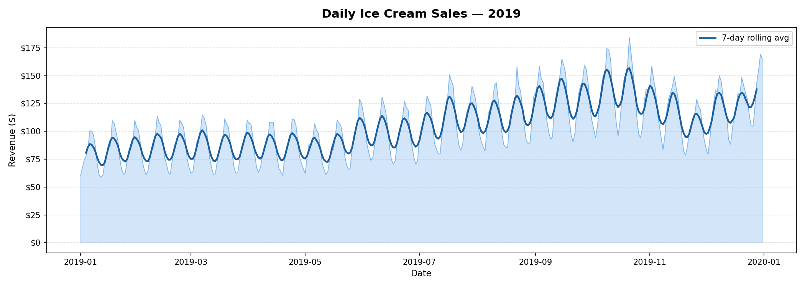

# 🍦 Ice Cream Sales Analysis

## Project Overview

This project explores one year of ice cream sales data using Python and data visualisation.

The goal was to identify sales trends, compare flavour popularity, and measure the impact of temperature on daily revenue using statistical analysis.

## Dataset

Three datasets were used:
- **SalesByDay.xlsx** — daily revenue for all of 2019 (365 rows)
- **SalesByFlavor.xlsx** — weekly unit sales per flavour across 4 flavours (chocolate, lemon, strawberry, vanilla)
- **SalesByTemp.xlsx** — temperature vs daily revenue pairs (365 rows)

## Tools & Libraries

- Python
- pandas
- matplotlib
- numpy
- scipy

## Key Findings

- Total 2019 revenue: **$38,142**
- Best single day: **$184.11** (21 Oct 2019)
- Top flavour: **Lemon** (713 units sold)
- Temperature explains **97.7%** of sales variance (R² = 0.977)
- Weekends consistently outsell weekdays

## Visualisations

